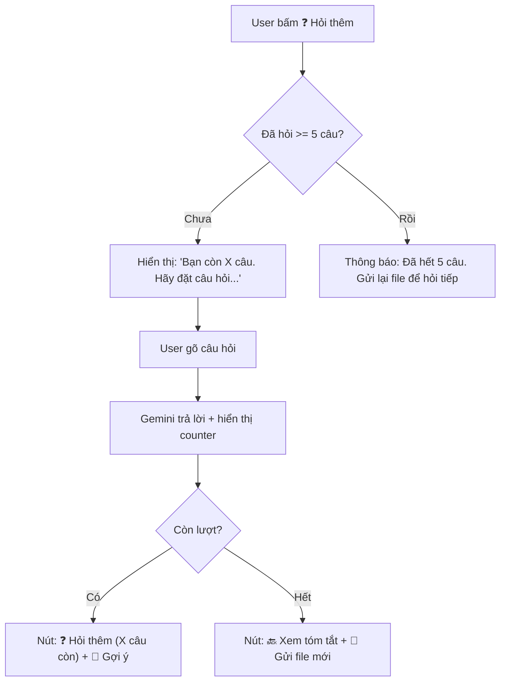
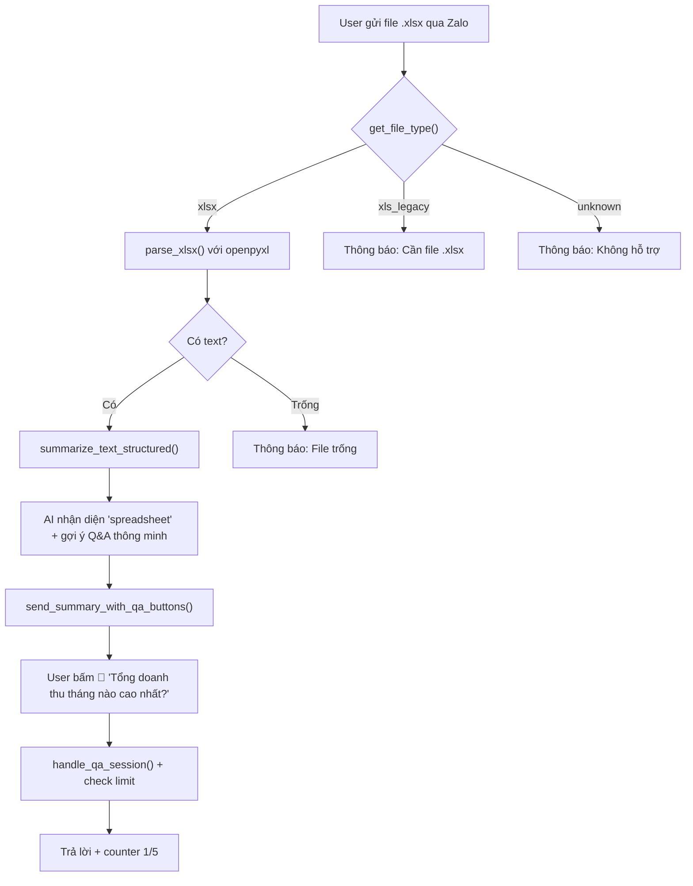

# 📊 Plan: Thêm Hỗ Trợ Excel + Giới Hạn Q&A cho CHAT HAY

## Tổng quan

**2 tính năng:**
1. **Excel Support** — User gửi file `.xlsx` → bot parse → Gemini tóm tắt → buttons tương tác
2. **Q&A Limit (5 câu/tài liệu)** — Giới hạn hỏi đáp 5 câu/document, áp dụng **tất cả loại file** (không chỉ Excel)

Cả 2 tính năng gợi ý câu hỏi thông minh cho Excel (phân tích số liệu, so sánh cột, tính toán...).

---

## 📁 Files cần sửa (5 files)

| File | Việc |
|------|------|
| `requirements.txt` | +`openpyxl` |
| `services/document_parser.py` | +`parse_xlsx()`, update `get_file_type()`, `extract_text()` |
| `services/ai_summarizer.py` | +doc type "spreadsheet", gợi ý Q&A cho Excel |
| `services/db_service.py` | +Q&A counter: `increment_qa_count()`, `get_qa_count()`, `reset_qa_count()` |
| `zalo_webhook.py` | Excel flow + Q&A limit check + UI messages |

---

## 1️⃣ `requirements.txt` — Thêm dependency

```diff
 # Document Processing
 pdfplumber==0.11.4
 PyMuPDF==1.24.10
 python-docx==1.1.2
 Pillow==10.4.0
+openpyxl==3.1.5
```

> [!NOTE]
> `openpyxl` chỉ hỗ trợ `.xlsx`. File `.xls` (Excel 2003) → thông báo user chuyển sang `.xlsx`.

---

## 2️⃣ `services/document_parser.py` — Core Excel parser

### 2a. Thêm hàm `parse_xlsx()` (~45 dòng)

```python
async def parse_xlsx(file_path: str, max_rows_per_sheet: int = 500) -> str:
    """Extract text from Excel .xlsx — tất cả sheets, format bảng."""
```

**Logic:**
1. `openpyxl.load_workbook(file_path, data_only=True, read_only=True)`
2. Duyệt từng sheet (chỉ visible):
   - Header: `📋 Sheet: "Tên" (X hàng × Y cột)`
   - Row 1 = header → bold/highlight
   - Các row tiếp → join cells bằng ` | `
   - Skip hàng trống
   - Cắt ở `max_rows_per_sheet=500`
3. Thêm metadata cuối text: `[Excel: X sheets, Y hàng tổng]`
4. Return text gộp

**Edge cases:**

| Case | Xử lý |
|------|--------|
| Merged cells | `openpyxl` trả `None` cho cells bị merge → thay `""` |
| Cell = số/ngày | `str()` convert |
| Sheet ẩn | Skip |
| File lớn (>10K hàng) | Cắt ở 500 hàng/sheet, log cảnh báo |
| File `.xls` | Chặn sớm ở `get_file_type()` → thông báo riêng |

### 2b. Update `get_file_type()`

```diff
 type_map = {
     ".pdf": "pdf",
     ".doc": "docx",
     ".docx": "docx",
+    ".xlsx": "xlsx",
+    ".xls": "xls_legacy",
     ".jpg": "image",
     ...
 }
```

### 2c. Update `extract_text()`

```diff
 elif file_type == "docx":
     text = await parse_docx(file_path)
     return text, file_type

+elif file_type == "xlsx":
+    text = await parse_xlsx(file_path)
+    return text, file_type
```

---

## 3️⃣ `services/ai_summarizer.py` — Doc type + Smart Q&A cho Excel

### 3a. Thêm doc type "spreadsheet"

```diff
 DOC_TYPE_LABELS = {
     "invoice": "🧾 Hóa đơn",
     "contract": "📄 Hợp đồng",
+    "spreadsheet": "📊 Bảng tính",
     ...
 }
```

### 3b. Cập nhật prompt `_build_text_prompt()` — Gợi ý Q&A cho bảng tính

Thêm vào phần `suggested_questions` trong prompt:

```diff
 ❓ SUGGESTED QUESTIONS (suggested_questions):
 - Gợi ý 2-3 câu hỏi mà người đọc có thể MUỐN HỎI THÊM về tài liệu này.
+- Nếu tài liệu là BẢNG TÍNH/EXCEL: ưu tiên gợi ý câu hỏi phân tích dữ liệu:
+  VD: "Tổng doanh thu tháng nào cao nhất?", "So sánh chi phí Q1 và Q2?",
+  "Ai có lương cao nhất?", "Trung bình điểm môn Toán là bao nhiêu?"
```

### 3c. Thêm hint cho Gemini khi text đến từ Excel

Trong `_build_text_prompt()`, detect nếu text chứa marker `[Excel:` → thêm vào prompt:

```python
# Detect Excel source
excel_hint = ""
if "[Excel:" in text:
    excel_hint = """
ĐÂY LÀ DỮ LIỆU TỪ FILE EXCEL (bảng tính).
- Phân tích SỐ LIỆU cụ thể: tổng, trung bình, min, max, so sánh giữa các cột/hàng.
- suggested_questions PHẢI là câu hỏi phân tích dữ liệu (tính tổng, so sánh, tìm max/min, xu hướng...).
- Nếu có nhiều sheet, so sánh giữa các sheet.
"""
```

---

## 4️⃣ `services/db_service.py` — Q&A Counter (TÍNH NĂNG MỚI)

### Mục đích
Giới hạn **5 câu hỏi Q&A / mỗi document** để tránh lạm dụng API Gemini.

### Thêm 3 hàm mới (~30 dòng):

```python
# ===== Q&A COUNTER =====
# Đếm số câu Q&A đã hỏi cho mỗi document
# Key: "user_id:doc_id" -> count
_memory_qa_count: dict[str, int] = {}
QA_LIMIT_PER_DOC = 5

def get_qa_count(user_id: int | str, doc_id: str) -> int:
    """Lấy số câu Q&A đã hỏi cho document này."""
    key = f"{user_id}:{doc_id}"
    return _memory_qa_count.get(key, 0)

def increment_qa_count(user_id: int | str, doc_id: str) -> int:
    """Tăng counter Q&A. Trả về số câu đã hỏi (sau khi tăng)."""
    key = f"{user_id}:{doc_id}"
    _memory_qa_count[key] = _memory_qa_count.get(key, 0) + 1
    return _memory_qa_count[key]

def reset_qa_count(user_id: int | str, doc_id: str):
    """Reset counter (khi user gửi lại file mới)."""
    key = f"{user_id}:{doc_id}"
    _memory_qa_count.pop(key, None)
```

### Cleanup integration
- Thêm cleanup `_memory_qa_count` vào `delete_user_data()`
- Thêm cleanup vào `delete_document_by_id()`

> [!IMPORTANT]
> Counter lưu in-memory (giống `_memory_doc_text_temp`). Khi server restart thì reset — chấp nhận được vì Q&A text temp cũng bị reset.

---

## 5️⃣ `zalo_webhook.py` — Tích hợp Excel + Q&A Limit

### 5a. Excel: Xử lý `.xls` legacy

```python
# Trong handle_zalo_file(), sau check "unknown":
if get_file_type(file_name) == "xls_legacy":
    await send_text_message(
        user_id,
        "📊 File .xls (Excel cũ) — mình cần file .xlsx nhé!\n\n"
        "Mở file → Save As → chọn .xlsx → gửi lại 😊"
    )
    return
```

### 5b. Update UI messages (~5 chỗ)

| Vị trí | Sửa |
|--------|------|
| `get_welcome_message()` | Thêm "bảng tính Excel" vào danh sách |
| `get_upload_prompt()` | `PDF/Word` → `PDF/Word/Excel` |
| `get_menu_message()` | `📎 GỬI FILE → PDF, Word` → `PDF, Word, Excel` |
| Reject message (L1638) | Thêm "Excel (.xlsx)" |
| `handle_zalo_file()` docstring | Thêm "Excel" |

### 5c. Q&A Limit — Sửa `handle_qa_session()` (QUAN TRỌNG)

```python
async def handle_qa_session(user_id: str, question: str):
    active_doc = get_active_doc(user_id)
    if not active_doc:
        await send_text_message(user_id, "⚠️ Chưa có tài liệu nào...")
        return

    doc_id = active_doc.get("id", "")

    # ── CHECK Q&A LIMIT ──
    current_count = get_qa_count(user_id, doc_id)
    if current_count >= QA_LIMIT_PER_DOC:
        await send_text_message(
            user_id,
            f"⚠️ Bạn đã hỏi {QA_LIMIT_PER_DOC}/{QA_LIMIT_PER_DOC} câu cho tài liệu này rồi!\n\n"
            "💡 Muốn hỏi thêm? Gửi lại file để mở phiên mới nhé.\n"
            "Hoặc gửi tài liệu khác — mình luôn sẵn sàng! 📎"
        )
        return

    # ... existing logic ...

    # Sau khi trả lời thành công:
    new_count = increment_qa_count(user_id, doc_id)
    remaining = QA_LIMIT_PER_DOC - new_count

    # ── HIỂN THỊ SỐ CÂU CÒN LẠI ──
    if remaining > 0:
        response = (
            f"💡 **Trả lời:**\n\n{answer}\n\n"
            f"──────────────────\n"
            f"📊 Đã hỏi {new_count}/{QA_LIMIT_PER_DOC} câu"
        )
    else:
        response = (
            f"💡 **Trả lời:**\n\n{answer}\n\n"
            f"──────────────────\n"
            f"📊 Đã dùng hết {QA_LIMIT_PER_DOC} câu hỏi cho tài liệu này"
        )

    # Buttons: ẩn "Hỏi câu khác" nếu hết lượt
    buttons = []
    if remaining > 0:
        buttons.append({
            "title": f"❓ Hỏi thêm ({remaining} câu còn)",
            "type": "oa.query.show",
            "payload": "HỎI THÊM",
        })
    # ... suggested questions buttons + back button ...
```

### 5d. Q&A Limit — Sửa nút "HỎI THÊM" trigger

```python
# Trong handle_interactive_command(), phần "HỎI THÊM":
if normalized in {"hỏi thêm", ...}:
    active_doc = get_active_doc(user_id)
    if active_doc:
        current_count = get_qa_count(user_id, active_doc.get("id", ""))
        if current_count >= QA_LIMIT_PER_DOC:
            await send_text_message(
                user_id,
                f"⚠️ Đã hết {QA_LIMIT_PER_DOC} câu hỏi cho tài liệu này.\n"
                "📎 Gửi lại file hoặc gửi tài liệu mới để hỏi tiếp nhé!"
            )
            return True

    set_pending_action(user_id, "qa_session", {})
    remaining = QA_LIMIT_PER_DOC - current_count
    await send_text_message(
        user_id,
        f"❓ Bạn còn {remaining} câu hỏi cho tài liệu này.\n"
        "Hãy đặt câu hỏi — mình sẽ phân tích và trả lời ngay:"
    )
    return True
```

### 5e. Reset counter khi gửi file mới

Trong `handle_zalo_file()`, sau khi tóm tắt thành công:

```python
# Reset Q&A counter cho document mới
reset_qa_count(user_id, doc_id)
```

---

## 🔄 Flow Q&A với limit



## 🔄 Flow Excel hoàn chỉnh



---

## ⚡ Tóm tắt thay đổi

| Metric | Giá trị |
|--------|---------|
| **Dòng code mới** | ~100 dòng |
| **Dòng code sửa** | ~25 dòng |
| **Dependency mới** | `openpyxl` (3.5MB, thuần Python) |
| **Risk** | Thấp — thêm nhánh mới + wrap logic Q&A hiện có |
| **Q&A Limit** | 5 câu/document, reset khi gửi file mới |

> [!IMPORTANT]
> **Zero-risk cho hệ thống hiện tại:**
> - Excel = nhánh mới hoàn toàn trong `document_parser.py`
> - Q&A limit = wrap thêm check trước logic hiện tại, **không sửa** core Q&A
> - Tất cả file types (PDF, Word, Image) đều được hưởng Q&A limit

> [!TIP]
> Q&A limit 5 câu là hợp lý vì:
> - Mỗi câu Q&A tốn ~80K tokens Gemini (full document context)
> - 5 câu đủ để user khai thác tài liệu mà không lạm dụng
> - User có thể gửi lại file để reset (= 1 lượt summarize mới)
